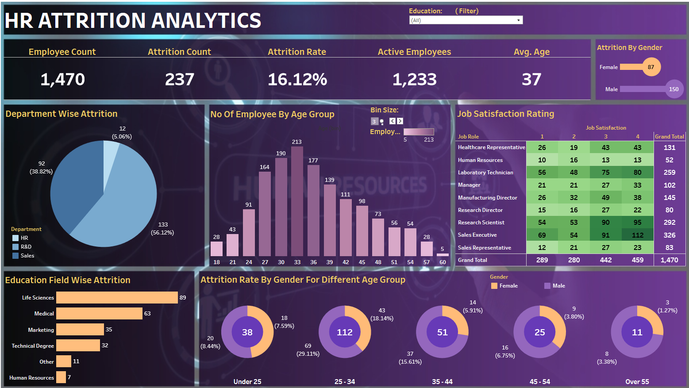

# Portfolio Projects
## Following are my projects in SQL, Python, Tableau, PowerBI & Excel:  

- [x] **EXCEL** - 

*Kindly download these Excel files from this repository, by clicking View raw, and view them in Microsoft Excel -> Then click on Enable Editing to Apply the Filters.*

  - ECommerce Revenue Analytics Portal :  With use of Pivot Tables, Pivot Chart, Slicers  
*Review the EXCEL Script:* **[HERE](https://github.com/saiky-111/DataPortfolioProjects/blob/master/01_EXCEL/EXCEL_01_ECommerce%20Revenue%20Analytics%20Portal.xlsx)** 

## Project 1: ECommerce Revenue Analytics Portal  

## Overview
This<b> E-Commerce Revenue Analytics Portal</b> involves designing a comprehensive Excel dashboard to visualize and analyze sales data. The dashboard includes key performance indicators (KPIs) such as total sales, profit, quantity sold, number of orders, and profit margin. It features interactive charts and graphs for detailed insights into sales trends, category-wise performance, regional distribution, and top products. The dashboard is equipped with filters for year, region, and segment, enabling users to dynamically explore and understand the data.
  
 

<!-- ## Insights and Questions Answered

1. **Total Sales and Profit**: 
   - What are the total sales and profit for the selected period?

2. **Profit Margin**: 
   - What is the profit margin for the selected period?

3. **Year-Over-Year Growth**: 
   - How has the year-over-year growth been for sales, profit, quantity, number of orders, and profit margin?

4. **Category-Wise Profit**: 
   - Which product categories contribute the most to profit?

5. **Top Subcategories by Sales**: 
   - What are the top 5 subcategories by sales?

6. **Regional Distribution**: 
   - What is the distribution of sales across different regions and states? -->

### Excel Dashboard : Completely Dynamic With Filters 

- [x] **Tableau** - 
## Project 2: HR Attrition Analytics  
## Overview
This<b> HR Attrition Analytics</b> dashboard provides interactive and comprehensive insights into employee attrition, showcasing metrics such as overall attrition rate, department-wise attrition, and attrition by gender and age group. It also includes job satisfaction ratings across different roles and education fields, allowing for detailed analysis to identify trends and areas of improvement.
  
 

### Tableau Dashboard : Completely Dynamic With Filters 
  - Check the LIVE DASHBOARD here: **[DASHBOARD LINK](https://public.tableau.com/app/profile/saikat.dhibar/viz/HRATTRITIONANALYTICS_17203705826090/HRATTRITIONANALYSIS)**   

- *Review the EXCEL Script:* **[HERE](https://github.com/saiky-111/DataPortfolioProjects/blob/master/02_TABLEAU/HR%20Data.xlsx)** 

- [x] **PYTHON** - 

## Web Scrapping  
### Project 3: Flipkart Product Scrapper  
### Overview
This <b>Flipkart Product Scraper</b> is a web scraper designed to extract product details (name, price, and rating) from Flipkart using Python. The extracted data is saved in a CSV file for easy access and analysis.
  

Features:

   1. Scrapes product name, price, and rating from Flipkart.
   2. Converts raw HTML data into a structured CSV file. 
*Check The Python Code :* **[HERE](https://github.com/saiky-111/DataPortfolioProjects/blob/master/03_PYTHON/Web_Scrapping/Flipkart_Scrapper/Flipkart_Scrapper.ipynb)** 
*Check the Extracted CSV Data:* **[HERE](https://github.com/saiky-111/DataPortfolioProjects/blob/master/03_PYTHON/Web_Scrapping/Flipkart_Scrapper/flipkart_data.csv)** 
*Data Was Extracted From:* **[HERE](https://www.flipkart.com/mobiles-accessories/mobiles/pr?sid=tyy,4io&q=mobile&otracker=categorytree)** 

- [x] **SQL** - 
### Project 4: Swiggy Data Analysis  
### Overview
This <b>SQL CASE STUDY : SWIGGY </b>contains an in-depth SQL-based analysis of restaurant data. The analysis addresses key business questions such as identifying top-rated restaurants, evaluating city-wise averages, and examining cost and cuisine trends across various restaurants.

  - Swiggy Data Analysis: REPORT : CHECKOUT   
*Check The SQL Report :* **[HERE](https://github.com/saiky-111/DataPortfolioProjects/blob/master/05_SQL/SWIGGY_CASE_STUDY/swiggy%20sql%20case%20study.pdf)** 
*Check The CSV File :* **[HERE](https://github.com/saiky-111/DataPortfolioProjects/blob/master/05_SQL/SWIGGY_CASE_STUDY/Swiggy.csv)** 
*Check The SQL Script :* **[HERE](https://github.com/saiky-111/DataPortfolioProjects/blob/master/05_SQL/SWIGGY_CASE_STUDY/swiggy_data_analysis.sql)** 
  
- [x] **PowerBI** - 
  -Upcoming.