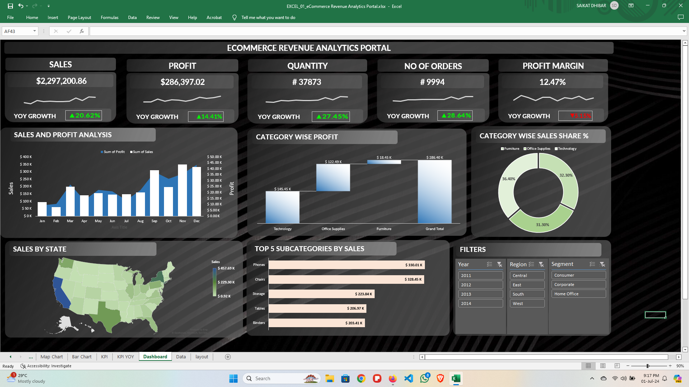
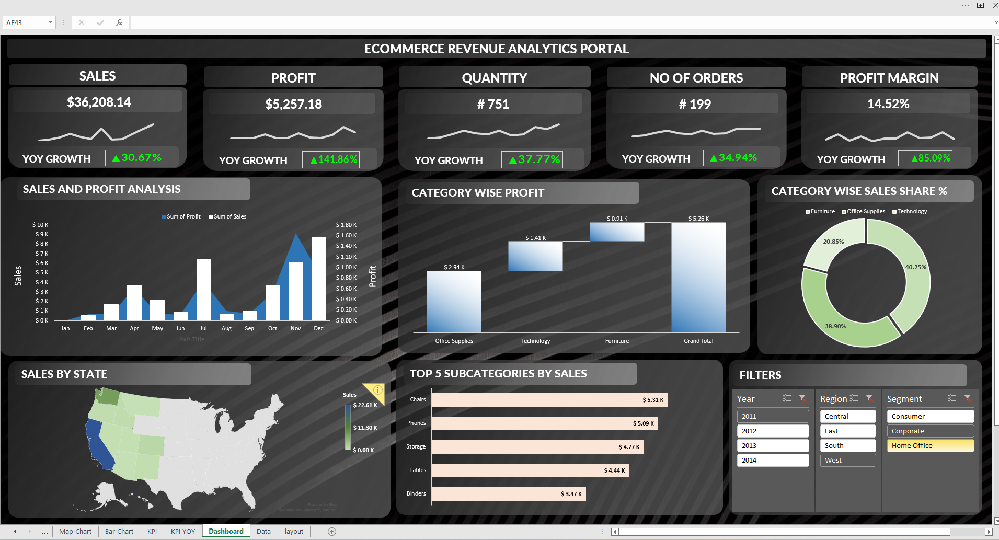

# Portfolio Projects
## Following are my projects in SQL, Python, Tableau, PowerBI & Excel:  

- [x] **EXCEL** - 

*Kindly download these Excel files from this repository, by clicking View raw, and view them in Microsoft Excel.*

  - ECommerce Revenue Analytics Portal: Pivot Tables, Pivot Chart, Slicers  
*Review the EXCEL Script:* **[HERE](https://github.com/saiky-111/DataEnthusiastPortfolioProjects/blob/master/EXCEL_01_eCommerce%20Revenue%20Analytics%20Portal.xlsx)** 

## Project 1: ECommerce Revenue Analytics Portal  
 
### Excel Dashboard : Completely Dynamic With Filters 

- [x] **SQL** - 
  - Swiggy Data Analysis: Data Cleaning  

- [x] **Tableau** - 

- [x] **PowerBI** - 